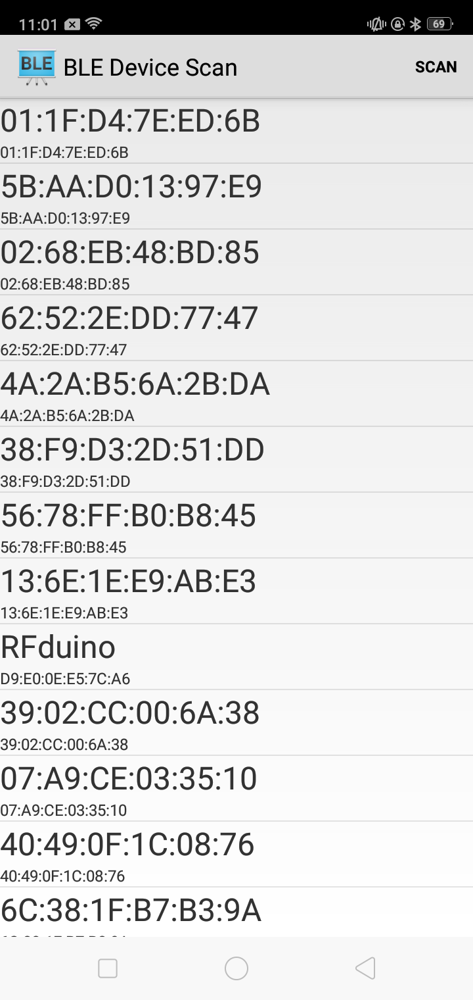
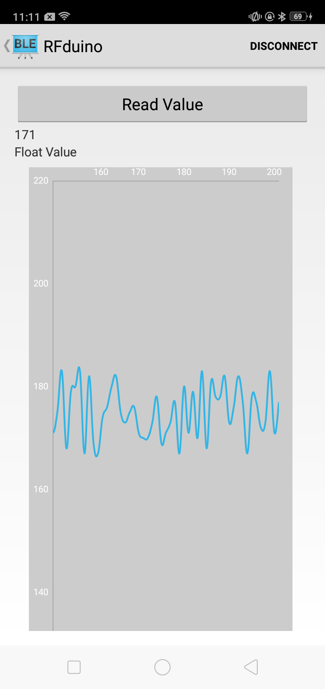

Ashwin's Bluetooth Low Energy Heart Rate Grapher
===================================

This sample is the initial prototype of a health app that connects to an ECG patch with Bluetooth LE capabilities
Please enable location services on your phone in order to access the scanning of nearby Bluetooth LE devices

Introduction
------------

This Bluetooth LE application shows a list of available Bluetooth LE devices and provides
an interface to connect, read, and graph characteristics supported by the devices.

It creates a [Service][1] for managing connection and data communication with a GATT server
hosted on a given Bluetooth LE device.

The Activities communicate with the Service, which in turn interacts with the [Bluetooth LE API][2].

References used from the Android Developer Website:
[1]:http://developer.android.com/reference/android/app/Service.html
[2]:https://developer.android.com/reference/android/bluetooth/BluetoothGatt.html

Pre-requisites
--------------

- Android SDK 27
- Android Build Tools v27.0.2
- Android Support Repository

Screenshots
-------------

 

Getting Started
---------------

This sample uses the Gradle build system. To build this project, use the
"gradlew build" command or use "Import Project" in Android Studio.

Licensing
---------------
Copyright [2020] [Ashwin Gopalan]

     Licensed under the Apache License, Version 2.0 (the "License");
     you may not use this file except in compliance with the License.
     You may obtain a copy of the License at

          http://www.apache.org/licenses/LICENSE-2.0

     Unless required by applicable law or agreed to in writing, software
     distributed under the License is distributed on an "AS IS" BASIS,
     WITHOUT WARRANTIES OR CONDITIONS OF ANY KIND, either express or implied.
     See the License for the specific language governing permissions and
     limitations under the License.
